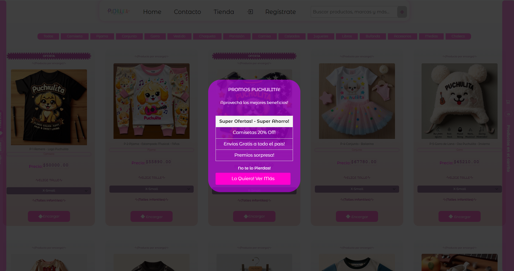
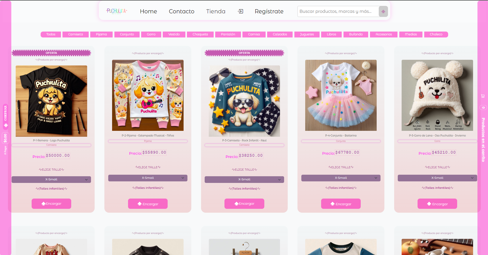
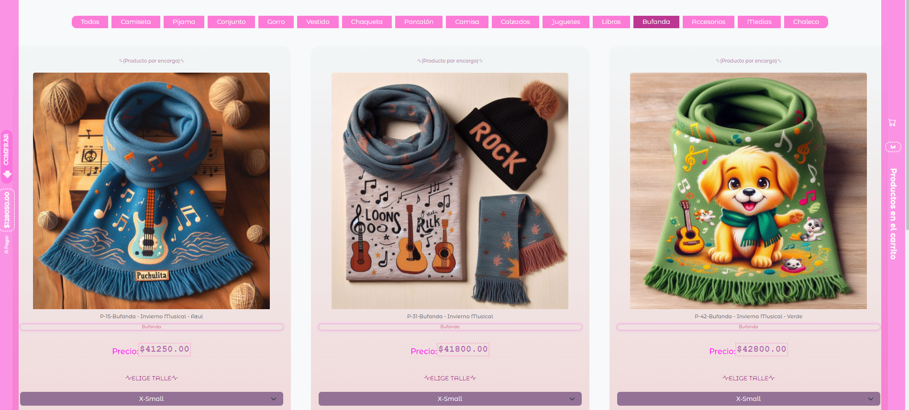
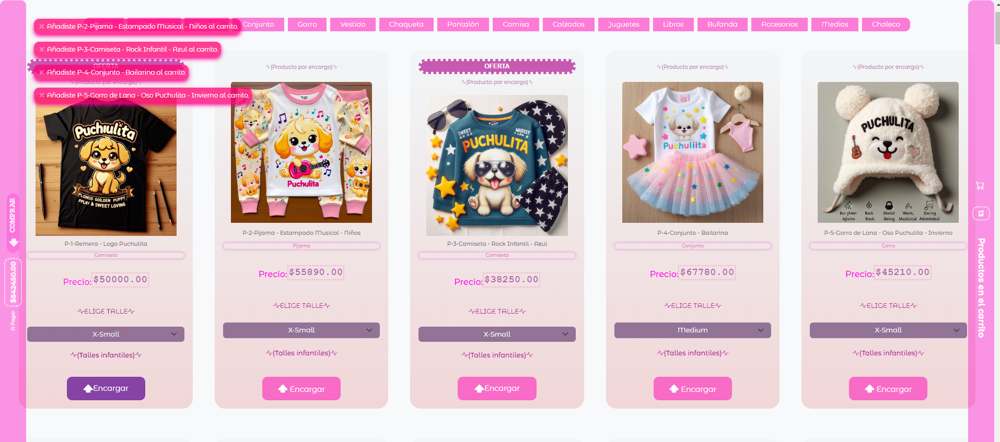
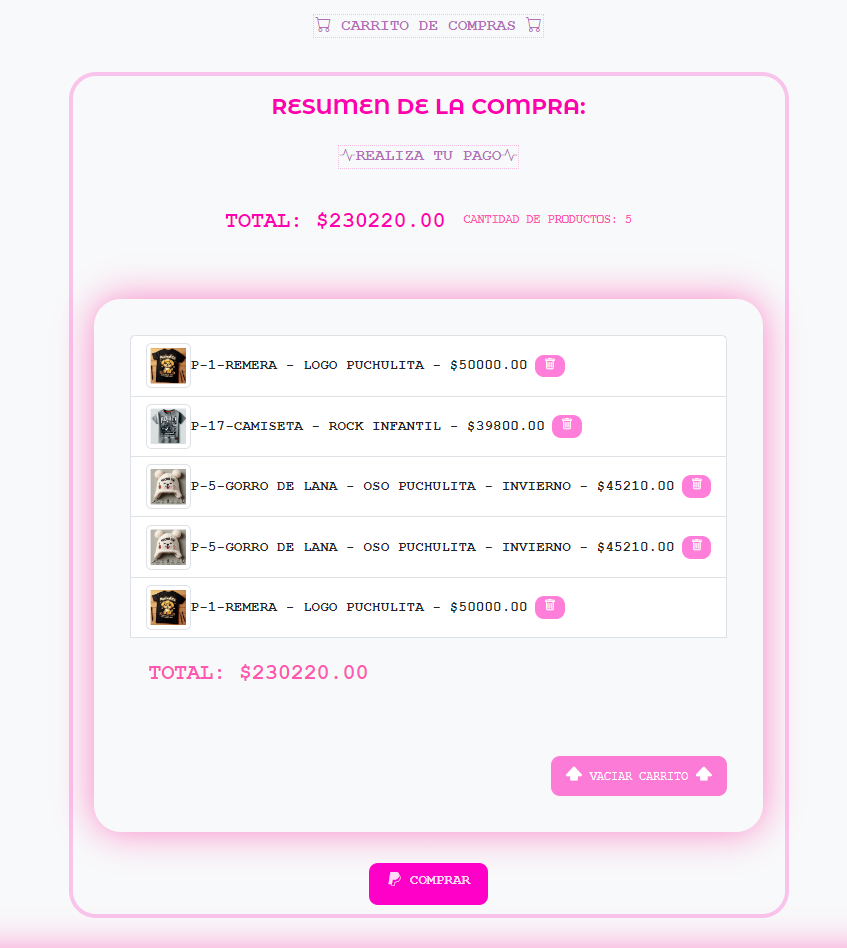
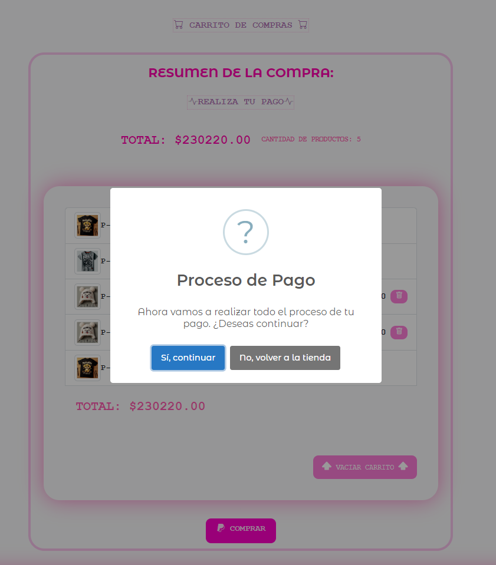

<<<<<<< HEAD
# Página de "Puchulita" - Tienda Infantil

## Descripción
Puchulita es una tienda online dedicada a la venta de productos musicales infantiles y ropa infantil musical. Aquí encontrarás una variedad de productos, desde juguetes musicales hasta ropa para niños y niñas.

## Tabla de Contenidos
1. [Instalación](#instalación)
2. [Uso](#uso)
3. [Archivos SASS](#archivos-sass)
4. [Componentes JSX](#componentes-jsx)
5. [Imágenes](#imágenes)
6. [SEO](#seo)
7. [Licencia](#licencia)
8. [Contacto](#contacto)
9. [Comentarios y Sugerencias para Mejorar la Documentación](#comentarios-y-sugerencias-para-mejorar-la-documentación)

## Instalación
Para instalar y ejecutar este proyecto en tu máquina local, sigue estos pasos:

1. Clona el repositorio:
    ```bash
    git clone https://github.com/alejandrobavaro/puchulitamusicainfantil.git
    ```
2. Navega al directorio del proyecto:
    ```bash
    cd puchulitamusicainfantil
    ```
3. Instala las dependencias:
    ```bash
    npm install
    ```
4. Inicia el servidor de desarrollo:
    ```bash
    npm start
    ```

### Requisitos Previos
Asegúrate de tener instalados los siguientes programas:
- Node.js
- npm (Node Package Manager)

### Configuración de Variables de Entorno
Si tu proyecto utiliza variables de entorno, crea un archivo `.env` en la raíz del proyecto y añade las variables necesarias. Ejemplo:

    ```makefile
    REACT_APP_API_URL=https://api.puchulitamusicainfantil.com
    REACT_APP_API_KEY=tu_api_key
    ```

## Uso
Puedes acceder a la aplicación en [https://puchulitamusicainfantil.netlify.app/](https://puchulitamusicainfantil.netlify.app/).

### Guía de Uso
#### Capturas de Pantalla
Aquí tienes capturas de pantalla y ejemplos de uso de la aplicación.







## Archivos SASS
Los siguientes archivos SASS se utilizan en el proyecto para el diseño y la estructura:

- `_BodyIndexApp.scss`

- `_AlertsModalsMsjs.scss`
- `_Contacto.scss`
- `_Footer.scss`
- `_Header.scss`
- `_MainContent.scss`
- `_Musica.scss`
- `_SesionLoginRegister.scss`
- `_Tienda.scss`
- `estilo.scss`

## Componentes JSX
Los siguientes componentes JSX se utilizan en el proyecto para la funcionalidad de la aplicación:

- `Contacto.jsx`
- `Footer.jsx`
- `Header.jsx`
- `HeaderSearchBar.jsx`
- `MainContent.jsx`
- `Musica.jsx`
- `MusicaCancionCard.jsx`
- `MusicaCancionesLista.jsx`
- `MusicaPublicidadSlider.jsx`
- `MusicaReproductor.jsx`
- `MusicaReproductorCard.jsx`
- `ReactMessage.jsx`
- `SesionAuthContent.jsx`
- `SesionLoadingSpinner.jsx`
- `SesionLogin.jsx`
- `SesionLogout.jsx`
- `SesionRegistrate.jsx`
- `Tienda.jsx`
- `TiendaAgrandarImgModal.jsx`
- `TiendaCarrito.jsx`
- `TiendaCarritoCompleto.jsx`
- `TiendaDetalleProducto.jsx`
- `TiendaMiniCarrito.jsx`
- `TiendaOfertasContext.jsx`
- `TiendaPopUpPromoInicio.jsx`
- `TiendaProducto.jsx`
- `TiendaProductos.jsx`
- `TiendaPublicidadSlider.jsx`
- `App.jsx`
- `main.jsx`

## Imágenes






## SEO
- **Descripción**: Página de la Tienda Musical Infantil Puchulita.
- **Palabras Clave**: Tienda musical Infantil Puchulita, Música Infantil, musica infantil, puchulita musica infantil, productos infantiles musicales, juguetes, ropa de niños y niñas, ropa infantil, tienda infantil, rock, children rocks, musica, niños, niñas musica para niños y niñas, canciones para niños y niñas, cancion para niños y niñas.
- **Título**: Home - Puchulita Tienda Musical Infantil.
- **Open Graph**:
  - **Título**: Puchulita Tienda Musical Infantil.
  - **Descripción**: Página del proyecto Tienda Musical Infantil Puchulita.
  - **Imagen**: 
  - **URL**: [https://puchulitamusicainfantil.netlify.app/](https://puchulitamusicainfantil.netlify.app/)

## Licencia
Este proyecto está creado por Gondra World Dev. Para más información, visita [Gondra World Dev](https://alejandrobavaro.github.io/gondraworld/).

## Contacto
Para cualquier consulta, puedes contactarme en:
- **Email**: bavaroalejandro@gmail.com
- **LinkedIn**: [Ale Bavaro](https://www.linkedin.com/in/alebavaro)

## Comentarios y Sugerencias para Mejorar la Documentación

### Instalación y Configuración

#### Clonar el Repositorio e Instalar Dependencias
Para instalar y ejecutar este proyecto en tu máquina local, sigue estos pasos:

1. Clona el repositorio:
    ```bash
    git clone https://github.com/alejandrobavaro/puchulitamusicainfantil.git
    ```
2. Navega al directorio del proyecto:
    ```bash
    cd puchulitamusicainfantil
    ```
3. Instala las dependencias:
    ```bash
    npm install
    ```
4. Inicia el servidor de desarrollo:
    ```bash
    npm start
    ```

### Configuración de Variables de Entorno

 
    REACT_APP_API_URL=https://api.puchulitamusicainfantil.com
    REACT_APP_API_KEY=tu_api_key


## Estructura del Proyecto
La estructura de carpetas y archivos importantes es la siguiente:

    ```css
    puchulitamusicainfantil/
    ├── public/
    │   ├── img/
    │   │   └── 07-documentacion/
    │   │       ├── documentacion1.png
    │   │       ├── documentacion2.png
    │   │       ├── documentacion3.png
    │   │       ├── documentacion4.png
    │   │       ├── documentacion5.png
    │   │       ├── documentacion6.png
    │   │       ├── documentacion7.png
    │   │       └── documentacion8.png
    ├── src/
    │   ├── components/
    │   │   ├── AuthContext.jsx
    │   │   ├── CarritoCompleto.jsx
    │   │   ├── CarritoTienda.jsx
    │   │   ├── Contacto.jsx
    │   │   ├── DetalleProducto.jsx
    │   │   ├── Footer.jsx
    │   │   ├── Header.jsx
    │   │   ├── ImageModal.jsx
    │   │   ├── Login.jsx
    │   │   ├── Logout.jsx
    │   │   ├── MainContent.jsx
    │   │   ├── Message.jsx
    │   │   ├── MiniCarrito.jsx
    │   │   ├── OfertasContext.jsx
    │   │   ├── PopUpModal.jsx
    │   │   ├── Producto.jsx
    │   │   ├── ProductoLista.jsx
    │   │   ├── ProductosTienda.jsx
    │   │   ├── PublicidadDebajo.jsx
    │   │   ├── SearchBar.jsx
    │   │   └── Tienda.jsx
    │   ├── App.jsx
    │   ├── main.jsx
    ├── sass/
    │   ├── 00-responsive.scss
    │   ├── 01-body.scss
    │   ├── 02-main.scss
    │   ├── 03-header-nav.scss
    │   ├── 04-footer.scss
    │   ├── 05a-textos.scss
    │   ├── 05b-formularios.scss
    │   ├── 06-imagenes.scss
    │   ├── 07-grid-estructuras.scss
    │   ├── 08-cards.scss
    │   ├── 09-botones.scss
    │   ├── 10-animaciones.scss
    │   ├── 11-alerts-toasts.scss
    │   ├── 12-tienda.scss
    │   └── 13-popups.scss
    ├── .env
    ├── package.json
    ├── README.md
    └── ...
    ```

## Comentarios y Sugerencias para Mejorar la Documentación
Si tienes comentarios o sugerencias para mejorar la documentación, por favor háznoslo saber. Puedes crear un issue en el repositorio de GitHub o contactarnos directamente.

=======
# vhsvideoclubonline
Pagina del Proyecto VHS - VideoClub Retro Online
>>>>>>> 91549e4cad75b86c2d4f24593580ddedabc9c971
